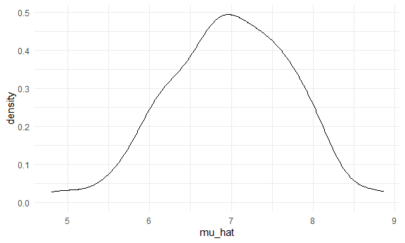
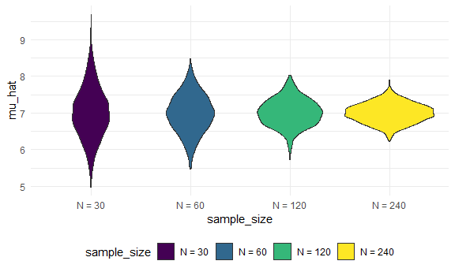
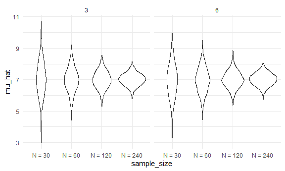

Simulation
================
Jasmine Niu (jn2855)
2022-11-03

## Simulations!!!

Here’s our functions from before.

``` r
sim_mean_sd = function(n_obs, mu = 7, sigma = 4) {
  
  x = rnorm(n = n_obs , mean = mu , sd = sigma)

tibble(
  mu_hat = mean(x),
  sigma_hat = sd(x)
)
  
}
```

How did we use this before?

``` r
sim_mean_sd(n_obs = 30)
```

    ## # A tibble: 1 × 2
    ##   mu_hat sigma_hat
    ##    <dbl>     <dbl>
    ## 1   7.33      3.70

How can we use this now…

Let’s start with a for loop!

``` r
output = vector("list", length = 100)

for (i in 1:100) {
  
  output[[i]] = sim_mean_sd(n_obs = 30)
  
}

bind_rows(output) %>% 
  view
```

Let’s use list columns instead.

``` r
sim_results_df = 
  expand_grid(
    sample_size = 30,
    iteration = 1:100
    ) %>% 
  mutate(
    estimate_df = map(sample_size, sim_mean_sd)
  ) %>% 
  unnest(estimate_df)
```

``` r
sim_results_df %>% 
  ggplot(aes(x = mu_hat)) +
  geom_density()
```



``` r
sim_results_df %>% 
  pivot_longer(
    mu_hat:sigma_hat,
    names_to = "parameter", 
    values_to = "estimate") %>% 
  group_by(parameter) %>% 
  summarize(
    emp_mean = mean(estimate),
    emp_sd = sd(estimate)) %>% 
  knitr::kable(digits = 3)
```

| parameter | emp_mean | emp_sd |
|:----------|---------:|-------:|
| mu_hat    |    6.980 |  0.756 |
| sigma_hat |    3.961 |  0.499 |

!!!!!!!!!!!!!!!!!!!!!!!!!!!

## Let’s see two inputs…

``` r
sim_results_df = 
  expand_grid(
    sample_size = c(30, 60, 120, 240),
    iteration = 1:1000
    ) %>% 
  mutate(
    estimate_df = map(sample_size, sim_mean_sd)
  ) %>% 
  unnest(estimate_df)
```

``` r
sim_results_df %>% 
  mutate(
    sample_size = str_c("N = ", sample_size),
    sample_size = fct_inorder(sample_size) #by the order in which they first appear
  ) %>% 
  ggplot(aes(x = sample_size, y = mu_hat, fill = sample_size)) +
  geom_violin()
```



``` r
sim_results_df %>% 
  pivot_longer(
    mu_hat:sigma_hat,
    names_to = "parameter", 
    values_to = "estimate") %>% 
  group_by(parameter, sample_size) %>% 
  summarize(
    emp_mean = mean(estimate),
    emp_var = var(estimate)) %>% 
  knitr::kable(digits = 3)
```

    ## `summarise()` has grouped output by 'parameter'. You can override using the
    ## `.groups` argument.

| parameter | sample_size | emp_mean | emp_var |
|:----------|------------:|---------:|--------:|
| mu_hat    |          30 |    7.008 |   0.488 |
| mu_hat    |          60 |    6.985 |   0.274 |
| mu_hat    |         120 |    7.009 |   0.140 |
| mu_hat    |         240 |    6.999 |   0.070 |
| sigma_hat |          30 |    3.968 |   0.268 |
| sigma_hat |          60 |    3.998 |   0.128 |
| sigma_hat |         120 |    3.996 |   0.066 |
| sigma_hat |         240 |    3.990 |   0.035 |

``` r
sim_results_df = 
  expand_grid(
    sample_size = c(30, 60, 120, 240),
    true_sigma = c(6, 3),
    iteration = 1:1000
    ) %>% 
  mutate(
    estimate_df = map(.x = sample_size, .y = true_sigma, ~sim_mean_sd(n_obs = .x, sigma = .y))
  ) %>% 
  unnest(estimate_df)
```

``` r
sim_results_df %>% 
  mutate(
    sample_size = str_c("N = ", sample_size),
    sample_size = fct_inorder(sample_size)
  ) %>% 
  ggplot(aes(x = sample_size, y = mu_hat)) +
  geom_violin() +
  facet_grid(. ~true_sigma)
```



## Using `rerun`

``` r
sim_results_df =   
  rerun(100, sim_mean_sd(30, 2, 3)) %>% 
  bind_rows()
```

``` r
n_list = 
  list(
    "n_30"  = 30, 
    "n_60"  = 60, 
    "n_120" = 120, 
    "n_240" = 240)

output = vector("list", length = 4)

for (i in 1:4) {
  output[[i]] = rerun(100, sim_mean_sd(n_list[[i]])) %>% 
    bind_rows
}
```

``` r
sim_results_df = 
  tibble(sample_size = c(30, 60, 120, 240)) %>% 
  mutate(
    output_lists = map(.x = sample_size, ~rerun(1000, sim_mean_sd(n = .x))),
    estimate_dfs = map(output_lists, bind_rows)) %>% 
  select(-output_lists) %>% 
  unnest(estimate_dfs)
```
